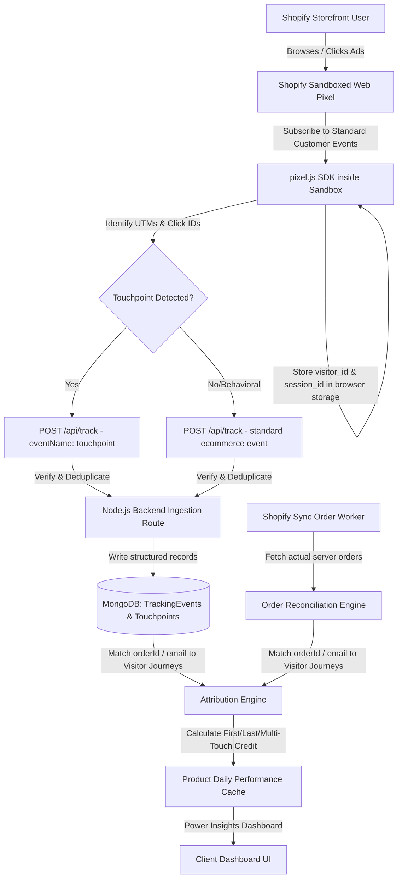

# Shopify Web Pixel Tracking & Multi-Touch Attribution Engine

We propose building a production-grade first-party tracking and attribution layer for the `admanager` platform. This architecture leverages Shopify’s modern sandboxed **Web Pixels API (Customer Events)** for browser-side behavior tracking, coupled with a robust, database-backed **Touchpoints & Event Ingestion API** on our Node.js backend. 

The goal is to shift attribution logic from simple single-touch URL scraping to a flexible multi-touch model (First Touch, Last Touch, Linear, etc.) while preserving your existing product intelligence, inventory alerts, and Meta API reconciliation logic.

---

## 🛠️ System Architecture Data Flow



---

## 1. User Review Required

> [!IMPORTANT]
> **Web Pixel Deployment Mode:**
> To bypass limitations of legacy script tags, we will deploy our tracking code as a **Shopify Custom Pixel**. 
> * The merchant can copy and paste the compiled sandboxed tracking script directly into their **Shopify Admin** under `Settings > Customer Events > Add Custom Pixel`.
> * This sandbox has access to standard browser storage (`browser.localStorage`, `browser.cookie`) and receives standardized events directly from the Shopify checkout and product pages.
>
> **Privacy Consent Handling:**
> The script will subscribe to Shopify's standardized consent event API. If customer privacy consent is required and not granted, the pixel will operate in a restricted "anonymous session-only" mode or halt execution, respecting GDPR/CCPA flags.

---

## 2. Proposed Changes

### Database Layer

#### [NEW] [TrackingEvent.js](file:///e:/Office%20Projects/admanager/server/src/models/TrackingEvent.js)
Stores behavioral user actions captured by the storefront.
```javascript
const TrackingEventSchema = new mongoose.Schema({
  storeUrl: { type: String, required: true, index: true },
  visitorId: { type: String, required: true, index: true },
  sessionId: { type: String, required: true, index: true },
  eventId: { type: String, required: true, unique: true }, // Client-side generated UUID
  eventName: { 
    type: String, 
    required: true,
    enum: ['page_viewed', 'product_viewed', 'product_added_to_cart', 'checkout_started', 'checkout_completed']
  },
  timestamp: { type: Date, required: true },
  url: String,
  referrer: String,
  checkoutId: { type: String, index: true }, // Present in checkout_started and checkout_completed
  shopifyOrderId: { type: String, index: true }, // For purchase reconciliation
  metadata: mongoose.Schema.Types.Mixed // Variable metrics like productIds, values, currency
}, { timestamps: true });
```

#### [NEW] [Touchpoint.js](file:///e:/Office%20Projects/admanager/server/src/models/Touchpoint.js)
Stores marketing traffic entries (independent of events) to preserve attribution history.
```javascript
const TouchpointSchema = new mongoose.Schema({
  storeUrl: { type: String, required: true, index: true },
  visitorId: { type: String, required: true, index: true },
  sessionId: { type: String, required: true, index: true },
  timestamp: { type: Date, required: true },
  utmSource: { type: String, index: true },
  utmMedium: String,
  utmCampaign: String,
  utmContent: String,
  utmTerm: String,
  clickId: {
    fbclid: String, // Meta
    gclid: String,  // Google
    ttclid: String  // TikTok
  },
  url: String,
  referrer: String
}, { timestamps: true });
```

---

### Backend Logic & API Routes

#### [NEW] [routes/tracking.js](file:///e:/Office%20Projects/admanager/server/src/routes/tracking.js)
Exposes the secure HTTP ingestion endpoints:
* **`POST /api/track`**:
  * Authenticates/validates incoming `storeUrl` parameter (validates merchant status).
  * Validates payload structure and fields.
  * Checks database for duplicate `eventId` to prevent double-counting.
  * If a touchpoint payload is detected (UTMs or click IDs exist), writes a new record to `Touchpoint`.
  * Writes behavioral payloads directly to `TrackingEvent`.
* **`GET /api/pixel-code`**: Returns the dynamically generated JavaScript code for merchants to paste into their Custom Pixel settings.

#### [MODIFY] [server.js](file:///e:/Office%20Projects/admanager/server/src/server.js)
* Mount `/api/track` and `/api/pixel-code` routes.
* Enable basic IP rate-limiting middleware on the `/api/track` endpoint.

---

### Shopify Custom Pixel Code

#### [NEW] [public/custom-pixel.js](file:///e:/Office%20Projects/admanager/server/src/public/custom-pixel.js)
The JavaScript tracking script running inside Shopify’s sandbox environment:
* **Consent Manager:** Subscribes to Shopify consent updates. Respects tracking limits.
* **Storage Engines:** Uses Shopify sandbox `browser.cookie` and `browser.localStorage` to manage `visitorId` (long-term UUID) and `sessionId` (expired after 30 minutes of inactivity).
* **UTM Tracker:** Parses `init.context.document.location.href` to capture UTM parameter strings and click tokens.
* **Event Subscriptions:** Registers standard event subscriptions:
  * `analytics.subscribe("page_viewed", ...)`
  * `analytics.subscribe("product_viewed", ...)`
  * `analytics.subscribe("product_added_to_cart", ...)`
  * `analytics.subscribe("checkout_started", ...)`
  * `analytics.subscribe("checkout_completed", ...)`
* **Reliable Purchase Tracking:** Captures Shopify's internal order details (like `order.id` or `checkout.token`) during `checkout_completed` events.
* **Transmission Protection:** Employs retry logic with exponential backoff on fetch failures.

---

### Attribution Engine Integration

#### [NEW] [lib/attribution.js](file:///e:/Office%20Projects/admanager/server/src/lib/attribution.js)
A modular utility to calculate credit distributions for a given order ID. It maps the visitor journey using stored touchpoints:
* **First Touch:** Attributes 100% of the sale to the earliest recorded Touchpoint in the visitor history.
* **Last Touch:** Attributes 100% of the sale to the latest Touchpoint prior to checkout.
* **Linear:** Distributes credit equally among all Touchpoints in the visitor history.
* **Time Decay / Position-Based:** Ready for expansion.

#### [MODIFY] [routes/shopify.js](file:///e:/Office%20Projects/admanager/server/src/routes/shopify.js)
Modify the `type=performance` pipeline:
1. When syncing Shopify orders, search for corresponding `checkout_completed` records in `TrackingEvent` matching the Shopify `orderId` or order email.
2. If matched, trace the `visitorId` and load all historical `Touchpoints` that occurred prior to the order timestamp.
3. Compute the attribution metrics using `lib/attribution.js`.
4. Fall back to your legacy `landing_site` UTM matching if no pixel touchpoints are found.
5. Compute blended ROAS, True ROAS, and inventory alerts without altering existing calculations.

---

## 3. Verification Plan

We will implement a verification script and manual test routines to validate the following scenarios:

### Core Integration Cases
* **New Visitor Journey:** Verify browser cookies generate fresh, valid `visitor_id` and `session_id`.
* **Returning Visitors:** Confirm `visitor_id` remains constant across multiple separate visits and days, while `session_id` expires and rotates after 30 minutes of inactivity.
* **Multi-Touch Timeline (Meta $\rightarrow$ Google $\rightarrow$ Direct):**
  1. Click 1: Land from Meta (`?utm_source=meta&fbclid=123`). Verify a `Touchpoint` is created with Meta credentials.
  2. Click 2 (Different session): Land from Google (`?utm_source=google&gclid=456`). Verify a second `Touchpoint` is created.
  3. Click 3 (Later, Direct): Land directly (`no UTMs`). Verify *no* new Touchpoint is created, but the session is recorded.
  4. Complete Checkout: Verify the final attribution models correctly assign credit:
     * **First Touch:** Meta Ad receives 100% credit.
     * **Last Touch:** Google Ad receives 100% credit (not Direct).
     * **Linear:** Meta and Google receive 50% credit each.

### Data Security & Validation
* **Deduplication Check:** Send duplicate tracking events with identical `eventId`s. Verify that only one is persisted.
* **Purchase Reconciliation:** Trigger browser purchase event with a dummy order ID. Sync Shopify orders containing that ID. Verify that the order's financial values are fetched *strictly* from Shopify API and the browser-provided value is disregarded.
* **Consent Handling:** Verify that when consent is marked "declined" via Shopify settings, tracking ceases or strips user identifier tokens.
